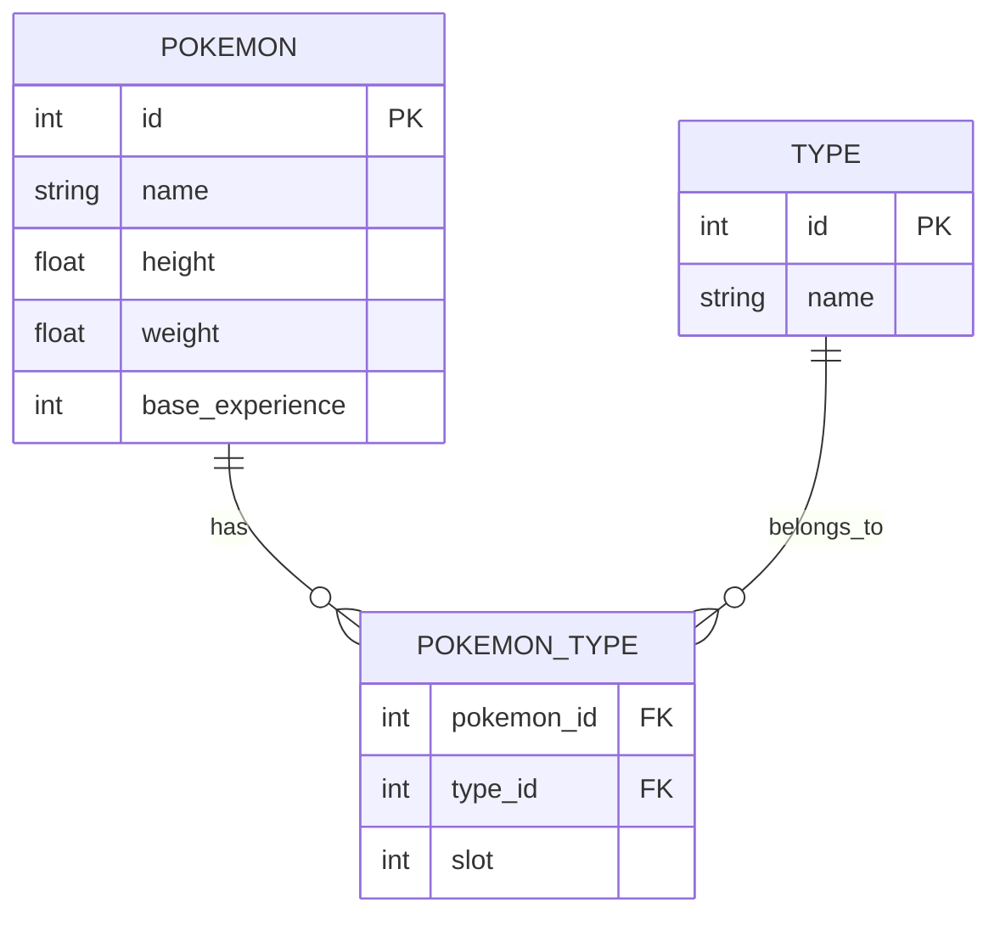

# 🎮 PokePipeline: Robust ETL Data Pipeline

This project is a modular, production-ready ETL pipeline that fetches Pokémon data from the PokeAPI and stores it in a normalized SQLite database with Pydantic validation.

## 🚀 Quick Start

**Prerequisites:** Python 3.9+
```bash
# Install dependencies
pip install -r requirements.txt

# Run the pipeline
python app.py
```

Output: `pokemon_data.db` SQLite database with normalized Pokémon data.

## 🏗️ Architecture

### ETL Modules (`src/data_pipeline/`)

| File | Role | Description |
|------|------|-------------|
| `extractor.py` | **Extract** 📥 | Fetches raw JSON from PokeAPI using `requests` |
| `transformer.py` | **Transform** ⚙️ | Normalizes nested JSON and validates with Pydantic models |
| `loader.py` | **Load** 💾 | Manages SQLite database with idempotent `DROP/CREATE` strategy |
| `app.py` | **Orchestration** 🎯 | Executes the E → T → L pipeline sequentially |

### Database Schema

| Table | Type | Fields |
|-------|------|--------|
| `pokemon` | Core Entity | `id` (PK), `name`, `height`, `weight`, `base_experience` |
| `type` | Lookup | `id` (PK), `name` (UNIQUE) |
| `pokemon_type` | Junction (M:N) | `pokemon_id` (FK), `type_id` (FK), `slot` |

**Design:** Many-to-Many relationship handles multiple types per Pokémon. `slot` preserves type ordering (primary/secondary).

### 🔬 Pipeline Verification
To confirm the successful execution of the ETL pipeline and the integrity of the normalized data, the resulting ``pokemon_data.db``SQLite file can be inspected using a database client like DBeaver.

The screenshot below visually validates the **Many-to-Many** relationship implementation, showing how a single Pokémon (**Charizard**, p.id = 6) is correctly linked to its multiple types (``Type``) via the ``pokemon_type`` junction table, and the correct ``slot`` order (``priority``) is preserved.

### Verification Result


| pokemon\_name | Tipo | priority |
| :--- | :--- | :--- |
| Charizard | fire | 1 |
| Charizard | flying | 2 |

## 🎯 Key Design Decisions

### 1. Type Normalization
Uses a global dictionary (`_type_name_to_id`) to assign unique IDs to types, avoiding duplication and enabling efficient queries.
```python
# First encounter: "fire" → ID 1
# Subsequent uses: reuse ID 1
```

### 2. Pydantic Validation
All data validated before database insertion:
- Enforces type safety (`height` must be float)
- Catches errors early (before DB operations)
- Self-documenting data contracts

### 3. 🧠 Design and Core Decisions

#### 3.1 Data Transformation and Database Schema

The PokeAPI data is naturally **nested and hierarchical**, which is often challenging for a relational database. To address this and satisfy the relational modeling requirement, the raw JSON structure is transformed into a normalized schema consisting of three tables, leveraging a **Many-to-Many relationship** for Pokémon types.

**Database Schema Overview (SQLite):**

| Table Name | Purpose | Key Fields | Relationship |
| :--- | :--- | :--- | :--- |
| `pokemon` | Stores core, unique attributes for each Pokémon. | `id` (PK), `name`, `height`, `weight` | PK |
| `type` | A lookup table (dictionary) for all unique Pokémon types (e.g., 'fire', 'water'). | `id` (PK), `name` | PK |
| `pokemon_type` | A **Junction Table** linking Pokémon to their specific types. This resolves the Many-to-Many relationship (a Pokémon has multiple types, and a type applies to many Pokémon). | `pokemon_id` (FK), `type_id` (FK) | FK to `pokemon` and `type` |

#### 3.2 Key Mapping Decision:

The critical transformation occurs when processing the `data['types']` array from the API response. For each type entry, the pipeline must:

1.  Extract the type name (`data['types'][i]['type']['name']`).
2.  Check the `type` table: **if the type doesn't exist, it is inserted**; otherwise, its existing `type.id` is retrieved.
3.  The resolved `type_id` and the Pokémon's `id` are then used to insert a record into the `pokemon_type` junction table, along with the `slot` information.
   
#### 3.3 Entity-Relationship (ER) Diagram



## 📋 Assumptions

- **Scope:** Designed for ~150 Pokémon (configurable via `limit` parameter)
- **Storage:** SQLite suitable for demo; production would use PostgreSQL
- **Processing:** Sequential requests; async would improve performance at scale
- **API Reliability:** 10-second timeout with basic error logging

## 🚀 Future Improvements

### High Priority
- ⚡ **Performance:** Async requests (`asyncio`), batch processing, connection pooling
- 🔄 **Incremental Updates:** Delta loading instead of full table drops
- 📊 **Logging:** Structured logging with metrics (records/sec, errors, duration)

### Medium Priority
- 🧪 **Testing:** Unit/integration tests with pytest and mocked API responses
- 🔐 **Resilience:** Retry logic with exponential backoff, circuit breaker pattern
- 📈 **Extended Data:** Add abilities, stats, evolutions, moves

### Nice to Have
- 🎨 **Dashboard:** Streamlit/Flask UI for pipeline monitoring
- 🔧 **Config Management:** Environment variables for API URL, DB path, batch size
- 📚 **API Layer:** FastAPI wrapper for querying normalized data

## 🐳 Docker Support (Optional)
```dockerfile
FROM python:3.9-slim
WORKDIR /app
COPY requirements.txt .
RUN pip install --no-cache-dir -r requirements.txt
COPY . .
CMD ["python", "app.py"]
```
```bash
docker build -t pokepipeline .
docker run -v $(pwd)/data:/app/data pokepipeline
```

---

**Data Source:** [PokéAPI](https://pokeapi.co/) | **Stack:** Python, Pydantic, SQLite

## 🤝 Contributions
Feel free to open an issue or pull request if you have ideas or improvements for the project.

© [Diana Terraza] - MIT Licens